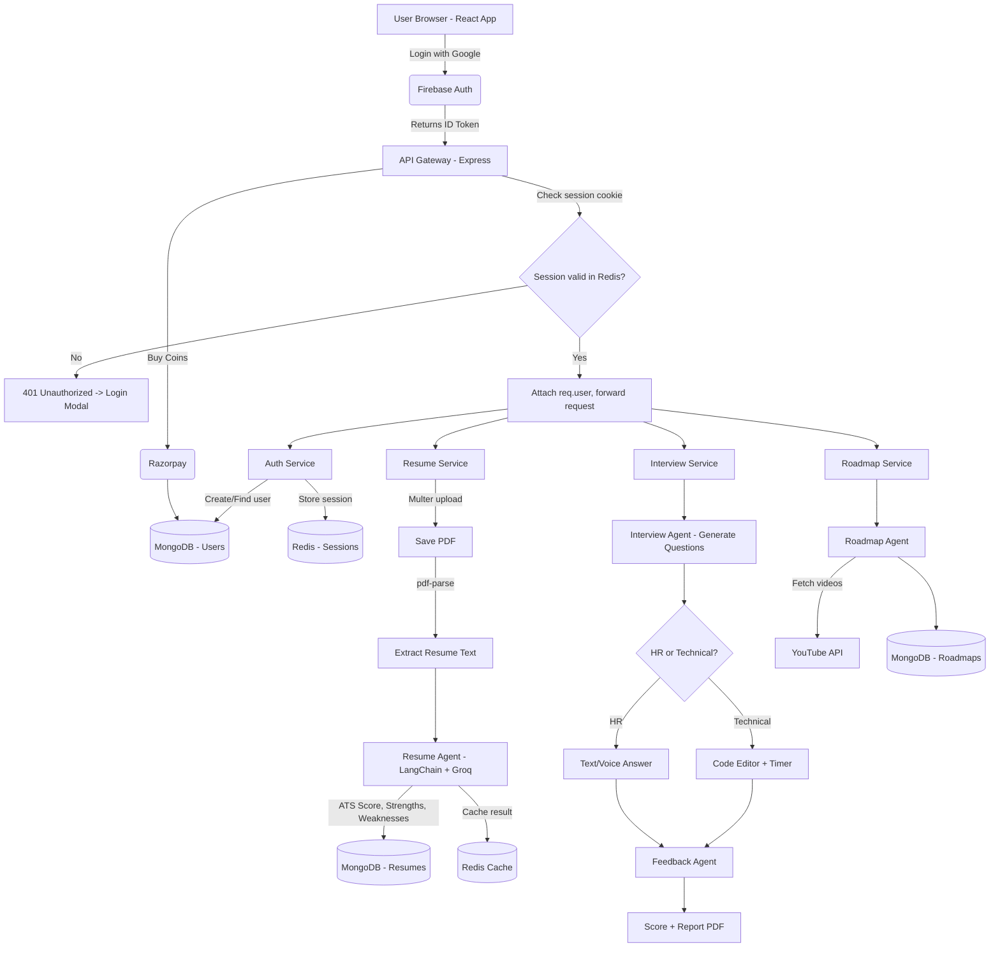

# CareerForge AI 🚀

**A Multi-Agent AI Interview Platform** that helps freshers and job seekers build ATS-friendly resumes, get AI-powered resume scoring, practice realistic HR & technical interviews, and follow a personalized learning roadmap — all in one place.

Instead of a single generic chatbot, CareerForge AI is powered by **four specialized AI agents**, each handling one part of the job-prep journey.

🔗 **Repo:** [github.com/kaku-coder/careerforge-ai](https://github.com/kaku-coder/careerforge-ai)

---

## ✨ Features

- 🔐 **Google Authentication** via Firebase, with server-side session management using Redis
- 📄 **Resume Builder** — multi-step form with a live, ATS-friendly preview and PDF export
- 📊 **Resume Scorer** — upload a PDF resume and get an AI-generated ATS score, strengths, weaknesses, missing skills, and recommendations
- 🎤 **AI Mock Interviews** — HR and Technical interview simulations with:
  - Text or voice-based answers
  - Camera & microphone support
  - Integrated code editor (JavaScript, Python, C++, TypeScript) for coding rounds
  - Auto-submission on timeout
- 📈 **AI Feedback Reports** — per-question scoring, strengths, improvement areas, and an overall performance report (exportable as PDF)
- 🗺️ **Personalized Roadmap Generator** — target role + salary goal + resume → a structured, multi-month learning plan with curated YouTube videos and articles
- 💰 **Interview Coins System** — usage-based credits for each feature, with Razorpay integration to purchase more
- 🧩 **Microservice Architecture** — independently deployable Auth, Resume, Interview, and Roadmap services behind a single API Gateway

---

## 🧠 The Agents

| Agent | Responsibility |
|---|---|
| **Resume Agent** | Analyzes an uploaded resume and returns an ATS score, strengths, weaknesses, missing skills, and suggested role |
| **Interview Agent** | Generates and conducts HR, technical, and coding interview questions |
| **Feedback Agent** | Evaluates submitted answers and produces per-question and overall performance reports |
| **Roadmap Agent** | Builds a personalized, topic-by-topic learning roadmap based on the target role and resume |

All agents are built with **LangChain** + **Groq (ChatGroq)**.



---

## 🏗️ Architecture

```
Client (React) → API Gateway (Express) → Microservices (Auth / Resume / Interview / Roadmap)
                                              ↓                ↓
                                          Redis (sessions,   MongoDB (persistent
                                          cache-aside)        storage)
                                              ↓
                                     LangChain + Groq (4 AI Agents)
```

- **Gateway** — single entry point; handles CORS, cookie-based auth middleware, and proxies requests to the right service via `http-proxy-middleware`, forwarding the authenticated user's ID through an `X-User-ID` header.
- **Redis** — stores session data (`session:{id}` → user info) and caches resume results (`resume:{userId}`) for fast reads (cache-aside pattern).
- **MongoDB (Mongoose)** — persistent storage for users, resumes, interviews, and roadmaps, each in its own service/collection.
- **Firebase** — client-side Google sign-in + server-side (`firebase-admin`) token verification.

> Full architecture diagram available in [`/docs/architecture.png`](./docs/architecture.png).

---

## 🛠️ Tech Stack

**Frontend**
- React 18 + Vite
- Redux Toolkit
- React Router DOM
- Tailwind CSS
- Motion (animations)
- Axios
- Recharts (score visualizations)

**Backend**
- Node.js + Express (API Gateway + Microservices)
- MongoDB + Mongoose
- Redis (ioredis) via Docker
- Multer (file uploads)
- pdf-parse (resume text extraction)
- Firebase Admin SDK (auth verification)
- LangChain + Groq (AI agents)
- Razorpay (payments)

**DevOps**
- Docker Compose (Redis)
- dotenv-based environment configuration per service

---

## 📂 Project Structure

```
careerforge-ai/
├── frontend/                # React + Vite client
│   ├── src/
│   │   ├── pages/           # Home, Dashboard, Resume Builder, Scorer, Interview, Roadmap
│   │   ├── components/      # Sidebar, LoginModal, EntryCard, ScoreRing, etc.
│   │   ├── redux/           # Store + slices (resume, user, etc.)
│   │   └── utils/            # Axios instance, Firebase config
│
├── backend/
│   ├── shared/redis/        # Shared Redis client used across services
│   ├── docker-compose.yml   # Redis container config
│   ├── gateway/             # API Gateway (auth middleware, proxy routing)
│   └── services/
│       ├── auth/            # Login, signup, session, logout
│       ├── resume/          # Upload, extraction, scoring, builder API
│       ├── interview/       # Interview creation, questions, evaluation
│       └── roadmap/         # Roadmap generation
```

---

## ⚙️ Getting Started

### Prerequisites
- Node.js (v18+)
- Docker (for Redis)
- MongoDB Atlas account (or local MongoDB)
- Firebase project (Google Auth enabled)
- Groq API key
- Razorpay account (optional, for payments)

### 1. Clone the repo
```bash
git clone https://github.com/kaku-coder/careerforge-ai.git
cd careerforge-ai
```

### 2. Start Redis
```bash
cd backend
docker compose up -d
```

### 3. Install dependencies
```bash
# Gateway
cd backend/gateway && npm install

# Each microservice
cd ../services/auth && npm install
cd ../resume && npm install
cd ../interview && npm install
cd ../roadmap && npm install

# Frontend
cd ../../../frontend && npm install
```

### 4. Configure environment variables
Create a `.env` file inside each service (gateway, auth, resume, interview, roadmap) and the frontend. See [Environment Variables](#-environment-variables) below.

### 5. Run the app
```bash
# In separate terminals
cd backend/gateway && npm run dev
cd backend/services/auth && npm run dev
cd backend/services/resume && npm run dev
cd backend/services/interview && npm run dev
cd backend/services/roadmap && npm run dev
cd frontend && npm run dev
```

The app will be available at `http://localhost:5173`, with the gateway running on `http://localhost:8000`.

---

## 🔑 Environment Variables

**Gateway (`backend/gateway/.env`)**
```
PORT=8000
REDIS_URL=redis://localhost:6379
AUTH_SERVICE_URL=http://localhost:8001
RESUME_SERVICE_URL=http://localhost:8002
INTERVIEW_SERVICE_URL=http://localhost:8003
ROADMAP_SERVICE_URL=http://localhost:8004
```

**Auth Service**
```
PORT=8001
MONGO_URL=your_mongodb_connection_string
REDIS_URL=redis://localhost:6379
```

**Resume / Interview / Roadmap Services**
```
PORT=800X
MONGO_URL=your_mongodb_connection_string
REDIS_URL=redis://localhost:6379
GROQ_API_KEY=your_groq_api_key
```

**Frontend (`frontend/.env`)**
```
VITE_FIREBASE_API_KEY=your_firebase_api_key
VITE_FIREBASE_AUTH_DOMAIN=your_firebase_auth_domain
VITE_FIREBASE_PROJECT_ID=your_firebase_project_id
```

> Firebase service account key (`service-account-key.json`) must be placed inside the **auth service** directory and referenced in its Firebase Admin config.

---

## 🗺️ Roadmap / Upcoming Improvements

- [ ] Interview coin deduction logic refinement
- [ ] Interview history & analytics dashboard
- [ ] Support for more coding languages in the in-browser editor
- [ ] Mobile-responsive interview room

---

## 🤝 Contributing

Contributions, issues, and feature requests are welcome! Feel free to check the [issues page](https://github.com/kaku-coder/careerforge-ai/issues).

---

## 📄 License

This project is licensed under the **MIT License** - see the [LICENSE](./LICENSE) file for details.

```text
MIT License - Copyright (c) 2026 CareerForge AI
```

---

⭐ If you found this project interesting, consider giving it a star on GitHub!
